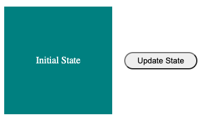
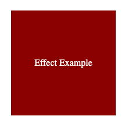
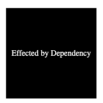

# Getting Started with Create React App

This project was bootstrapped with [Create React App](https://github.com/facebook/create-react-app).

`Available Scripts`

- `npm start`

Runs the app in the development mode.\
Open [http://localhost:3000](http://localhost:3000) to view it in your browser.

## 1. Hello World - Create A React Component

In `shared/Box.jsx`, I created a react component, which you can see below.


- You can set the styling of a component inside of it. You need to use camelcase for the properties of the item (`boxStyle`).

```jsx
import React from "react";

function Box({ children, bgColor = "teal" }) {
  const boxStyle = {
    color: "white",
    backgroundColor: bgColor,
    width: 180,
    height: 180,
    margin: "20px",
    display: "flex",
    alignItems: "center",
    justifyContent: "center",
  };

  return <div style={boxStyle}>{children}</div>;
}

export default Box;
```

- `children` is a special, automatically passed prop that you can use to render the content when you give it as a property to the component.

```jsx
<Box> Hello World </Box>
```

## 2. State Example - useState, Trigger Dom Update

React renders components if you say so. Consider a case when you want to update a text inside a component after clicking a button. Normally you just update the text variable and expect it to be updated, but this does not trigger React to re-render the component. For this type of scenario, useState is employed. In useState, you call the setter function to update the text, so React will be notified under the hood to re-render the component.

| First render                                     | After clicking the button                      |
| ------------------------------------------------ | ---------------------------------------------- |
|  |  |

```jsx
// useState hook is used to trigger update text variable
// so React can render accordingly
const [text, setText] = useState("Initial text state");

// here, we call setText to notify React
// so that it can render the required part of the Dom
const handleClick = () => setText(Math.random().toFixed(2));
```

## 3. Effect Example - useEffect, render in the background

`useEffect` lets us notify React to re-render when we need to reach outside of direct user input, such as when fetching data from an API or updating the DOM.

Let's think about this scenario: You have a red box, and when you are able to get the response to your API call, you want to change it to black. All these things are done in the background. You can use "useEffect" to update the color of the box after getting the response.

```jsx
const [bgColor, setbgColor] = useState("darkred");
const [text, setText] = useState("Effect Example");

useEffect(() => {
  setTimeout(() => {
    setbgColor("black");
  }, 2000);
}, []);
// []: this is a dependency array
// no parameter is given, will run when the component mount/unmount
// if a given parameter is updated, useEffect is triggered in the background

useEffect(() => {
  if (bgColor !== "darkred") {
    setText("Effected by Dependency");
  }

  // You can also return function when you need to run a method
  // when the component unmounts
  return () => {
    console.log("Cleaning");
  };
}, [bgColor]);
```

| First render                                       | After all useEffect functions are triggered      |
| -------------------------------------------------- | ------------------------------------------------ |
|  |  |
