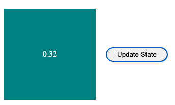
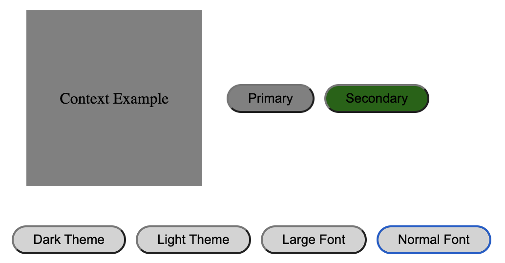

# React Basics (components and hooks)

This repo includes examples of react basics (including hooks)

- basics of creating react components
- useState
- useEffect
- useRef
- useLayoutEffect
- useReducer
- useImperativeHandle
- useContext
- custom hooks (useFetch and useLocalStorage)

`To install dependencies` run `npm i`

`To start the app` run `npm start`

It will open [http://localhost:3000](http://localhost:3000) so you can view it in your browser.

## 1. Hello World - Create A React Component

In `shared/Box.jsx`, a react component is created, which you can see both the code and the output below.


- You can set the styling of a component inside of it with a styling object. Beware that you need to use camelcase for the properties of the item as opposed to regular CSS. Please look at the `boxStyle` component.

```jsx
import React from "react";

function Box({ children, bgColor = "teal" }) {
  const boxStyle = {
    color: "white",
    backgroundColor: bgColor,
    width: 180,
    height: 180,
    margin: "20px",
    display: "flex",
    alignItems: "center",
    justifyContent: "center",
  };

  return <div style={boxStyle}>{children}</div>;
}

export default Box;
```

- `children` is a special, automatically passed prop that you can use to render the content when you give it as a property to the component.

```jsx
<Box> Hello World </Box>
```

## 2. State Example - useState, Trigger Dom Update

React renders components if you say so. Consider a case when you want to update a text inside a component after clicking a button. Normally you just update the text variable and expect it to be updated, but this does not trigger React to re-render the component. For this type of scenario, `useState` is employed. In `useState`, you call the setter function to update the text, so React will be notified under the hood to re-render the component.

| First render                                     | After clicking the button                      |
| ------------------------------------------------ | ---------------------------------------------- |
|  |  |

```jsx
// useState hook is used to trigger update text variable
// so React can render accordingly
const [text, setText] = useState("Initial text state");

// here, we call setText to notify React
// so that it can render the required part of the Dom
const handleClick = () => setText(Math.random().toFixed(2));
```

## 3. Effect Example - useEffect, render in the background

`useEffect` lets us notify React to re-render when we need to reach outside of direct user input, such as when fetching data from an API or updating the DOM.

Let's think about this scenario: You have a red box, and when you are able to get the response to your API call, you want to change it to black. All these things are done in the background. You can use `useEffect` to update the color of the box after getting the response.

| First render                                       | After all useEffect functions are triggered      |
| -------------------------------------------------- | ------------------------------------------------ |
|  |  |

```jsx
const [bgColor, setbgColor] = useState("darkred");
const [text, setText] = useState("Effect Example");

useEffect(() => {
  setTimeout(() => {
    setbgColor("black");
  }, 2000);
}, []);
// []: this is a dependency array
// no parameter is given, will run when the component mount/unmount
// if a given parameter is updated, useEffect is triggered in the background

useEffect(() => {
  if (bgColor !== "darkred") {
    setText("Effected by Dependency");
  }

  // You can also return function when you need to run a method
  // when the component unmounts
  return () => {
    console.log("Cleaning");
  };
}, [bgColor]);
```

# 4. Ref Example - useRef, manipulate the DOM directly

`Refs` allow us to create a reference to a given element or component when it mounts. when you need to make changes directly to the DOM, such as managing focus text selection or animating. Usually used in conjunction with `useLayoutEffect`.

| First render (Just Before painting the DOM)  | After useLayoutEffect function is triggered |
| -------------------------------------------- | ------------------------------------------- |
|  |   |

```jsx
const boxRef = useRef(null);

useLayoutEffect(() => {
  boxRef.current.innerHTML = "Updated via useRef";
}, []);

return (
  <Container>
    <Box>
      <p ref={boxRef}> UseRef Example </p>
    </Box>
  </Container>
);
```

## 5. Reducer Example - useReducer, manage states from a single point

`Reducers` also help you deal with `state management`. Rather than storing state variables in a component separately, you `gather all state variables` into a `single object` and pass that object to `the reducer function`. Then the state object is updated accordingly.


| First render (Initial State)                         | Following several requests for state changes       |
| ---------------------------------------------------- | -------------------------------------------------- |
|  |  |

```jsx
function ReducerExample() {
  // initial state parameter for this component
  const initialState = { messageItems: [] };

  // use reducer hook
  // takes reducer function which has state updating options, and initial state as parameters
  const [{ messageItems }, dispatch] = useReducer(reducer, initialState);
  // and returns the state object with dispatch function
  // you can not call the reducer function directly to update the state
  // you have to use the dispatch function that useReducer just returned.

  // dispatch function usually takes an argument object with two params
  // type: state name
  // payload: param to update the state

  const [customText, setCustomText] = useState("");

  return (
    <>
      <p>
        {messageItems.length > 0
          ? messageItems.map((item, index) => <span key={index}> {item} </span>)
          : "Reducer Example - Click the buttons below to update the state"}
      </p>
      <Container>
        <Button text="Add A" handleClick={() => dispatch({ type: "ADD_A" })} />
        <Button text="Add B" handleClick={() => dispatch({ type: "ADD_B" })} />
        <Button text="POP  " handleClick={() => dispatch({ type: "POP" })} />
        <Button
          text="ADD CUSTOM TEXT"
          handleClick={() =>
            dispatch({ type: "ADD_CUSTOM_TEXT", payload: { customText } })
          }
        />
        <input type="text" onChange={(e) => setCustomText(e.target.value)} />
      </Container>
    </>
  );
}

function reducer(state, action) {
  switch (action.type) {
    case "ADD_A":
      return {
        ...state,
        messageItems: [...state.messageItems, "A"],
      };
    case "ADD_B":
      return {
        ...state,
        messageItems: [...state.messageItems, "B"],
      };
    case "POP":
      const temp = [...state.messageItems];
      temp.pop();
      return {
        ...state,
        messageItems: temp,
      };
    case "ADD_CUSTOM_TEXT":
      return {
        ...state,
        messageItems: [...state.messageItems, ...action.payload.customText],
      };
    default:
      return {
        ...state,
      };
  }
}
```

## 6. Imperative Handle Example - useImperativeHandle, protect child properties by ref updates from it's parent

You can `update` the element in the `DOM` via the ref hook. However, you should not reach out to the ref of a `child` of an element via `useRef`.

You need to forward the reference in that case. In that case, you can set limitations on what a `parent` can do to a "child" via referencing by using the `useImperativeHandle` hook.

| Just After Clicking the focus button                             | 2 seconds later...                                             |
| ---------------------------------------------------------------- | -------------------------------------------------------------- |
|  |  |

```jsx
function ImperativeHandle() {
  const inputRef = useRef(null);

  const handleClick = () => inputRef.current.focusThenBlur();
  return (
    <Container>
      <InnerComponent forwardedRef={inputRef} />
      <Button text="Focus" handleClick={handleClick} />
    </Container>
  );
}

const InnerComponent = ({ forwardedRef }) => {
  const localRef = useRef(null);

  useImperativeHandle(forwardedRef, () => {
    return {
      focusThenBlur: () => {
        localRef.current.focus();
        setTimeout(() => {
          localRef.current.blur();
        }, 2000);
      },
    };
  });

  return <input type="text" ref={localRef} />;
};
```

## 7. Context Example - useContext, control states (mostly static) from a single point

When multiple components share states (mostly static) and store states in the parent, then passing state variables as props increases the complexity of the component. Using the Context API - `useContext`, we can share common state variables without prop drilling (passing props).

| Dark Theme with Large Font                           | Light Theme with Normal Font                             |
| ---------------------------------------------------- | -------------------------------------------------------- |
|  |  |

```jsx
// Step 1: Create Context
const ThemeContext = createContext();

const initialState = {
  bgColor: "gray",
  textColor: "black",
  btnPrimary: "gray",
  btnSecondary: "darkgreen",
  fontSize: "normal",
};

// step 2: export ThemeProvider, you wrap consumer with provider
// so they can use the values provided by it
export const ThemeProvider = ({ children }) => {
  // step 3: use reducer with initial state
  // to provide the current state and dispatch funtion to the consumers
  const [state, dispatch] = useReducer(reducer, initialState);

  // step 4: use Provider to serve values to the consumers
  return (
    <ThemeContext.Provider
      value={{
        ...state,
        dispatch,
      }}
    >
      {children}
    </ThemeContext.Provider>
  );
};

function reducer(state, action) {
  switch (action.type) {
    case "SET_DARK_THEME":
      return {
        ...state,
        bgColor: "black",
        textColor: "white",
        btnPrimary: "teal",
        btnSecondary: "violet",
      };
    case "SET_LIGHT_THEME":
      return {
        ...state,
        ...initialState,
      };
    case "SET_LARGE_FONT":
      return {
        ...state,
        fontSize: "large",
      };
    case "SET_NORMAL_FONT":
      return {
        ...state,
        fontSize: "medium",
      };
    default:
      return {
        ...state,
      };
  }
}
```

! Do not forget to provide values to the consumers

```jsx
<ThemeProvider>
  <ContextExample />
</ThemeProvider>
```

## 8. Custom Hook Examples

### 8.1 useFetch Hook

You can encapsulate fecth api and create custom hook so that you dont need to re-implement the same logic again and again.

| Before Fetching Data                             | Just After Receiving Data                      |
| ------------------------------------------------ | ---------------------------------------------- |
|  |  |

- Fetch random projects from gitlab api and list them
- to fetch the data use custom hook - useFetch

#### 8.1.a useFetch Hook usage

```jsx
  const { data, loading } = useFetch("https://gitlab.com/api/v4/projects", {});
}
```

#### 8.1.b useFetch Hook implmentation

```jsx
import { useState, useEffect } from "react";

function useFetch(url, options) {
  const [loading, setLoading] = useState(true);
  const [error, setError] = useState(null);
  const [data, setData] = useState(null);

  useEffect(() => {
    const fetchData = async () => {
      try {
        const response = await fetch(url, options);
        const data = await response.json();

        setData(data);
        setLoading(false);
      } catch (error) {
        setError(error);
        setLoading(false);
      }
    };

    fetchData();
    // eslint-disable-next-line react-hooks/exhaustive-deps
  }, []);

  return { data, loading, error };
}

export default useFetch;
```

### 8.2 useLocalStorage Hook

To use browser local storage, we can create custom hook. It can help us to encapsulate to complexity of using localStorage of browser, and avoid reimplementing the same functionality over and over again.


#### 8.2.a useLocalStorage Hook usage

```jsx
const [task, setTask] = useLocalStorage("task", "");
const [tasks, setTasks] = useLocalStorage("tasks", []);
```

#### 8.2.b useLocalStorage Hook implementation

```jsx
import { useState } from "react";

function useLocalStorage(key, initialValue) {
  const [localStorageValue, setLocalStorageValue] = useState(() =>
    getLocalStorageValue(key, initialValue)
  );

  const setValue = (value) => {
    // Check if function
    const valueToStore =
      value instanceof Function ? value(localStorageValue) : value;
    // Set to state
    setLocalStorageValue(value);
    // Set to local storage
    localStorage.setItem(key, JSON.stringify(valueToStore));
  };

  return [localStorageValue, setValue];
}

function getLocalStorageValue(key, initialValue) {
  const itemFromStorage = localStorage.getItem(key);
  return itemFromStorage ? JSON.parse(itemFromStorage) : initialValue;
}

export default useLocalStorage;
```
